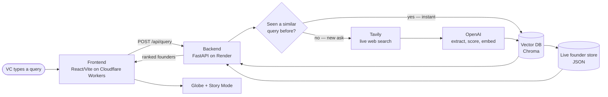
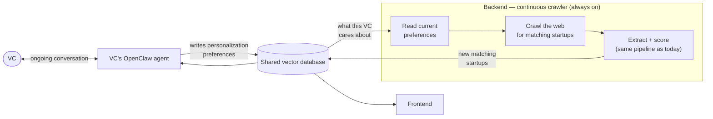

# Profound — Technical Architecture

## Positioning

**What's built for this hackathon:** a working backend + frontend demo. A VC types a query, the backend does a real live search-and-extract pipeline, and the frontend renders the ranked result. That's it — that's the whole demo, and it's fully functional end to end.

**What's not built yet:** the OpenClaw agent layer. The vision is a persistent agent the VC already talks to regularly about their portfolio and deal flow, wired into the *same* vector database this demo's backend writes to — so the VC's ongoing conversations keep that database aware of their thesis over time, not just aware of whatever founders got searched. That integration doesn't exist yet. Today the vector database is populated only by the search pipeline below, and there's no agent/chat layer sitting on top of it. It's the explicit next step, not a current feature — don't demo it as if it's live.

## Flow diagram — what's built today

Request-triggered, one shot: nothing happens until a VC types a query into the frontend. There's no standing process and no OpenClaw agent anywhere in this picture.

## Vision pipeline — roadmap, not built

The direction this is heading: the backend stops waiting for a query and instead **runs continuously**, crawling on its own initiative for startups that match what it already knows about the VC — and the VC's OpenClaw agent and the backend's crawler read and write **the same vector database**, so anything one side learns, the other can act on.

Two things change versus today's diagram: **(1)** the crawler is no longer triggered by a query — it runs on a loop, pulling personalization signals out of the VC's OpenClaw conversations and going out to find matches on its own; **(2)** OpenClaw and the frontend become two read/write views onto one shared database instead of the frontend being the only consumer. None of this loop exists yet — today, the vector database only ever gets written to in response to a query typed into the frontend (see diagram above).

## Stack

**Frontend** — React + TypeScript + Vite, MUI, framer-motion, `react-force-graph-2d`, `react-globe.gl`, Recharts, Zustand. Deployed to **Cloudflare Workers** (static assets), auto-deployed on every git push via Cloudflare's GitHub connector.

**Backend** — FastAPI (Python), packaged as a Docker container, deployed on **Render**. Per-IP sliding-window rate limiting in front of `/api/query` to protect OpenAI/Tavily quota. CORS wired to the Cloudflare frontend origin.

**Data / AI layer**
- **Tavily** — live web search for founder signals (raw results only — no embeddings happen here, that's Chroma's job below)
- **OpenAI `gpt-4o-mini`** — entity-type-aware extraction (classifies each find as startup / hackathon project / research / indie project), scoring, and enrichment
- **OpenAI `text-embedding-3-small`** — embeds both queries and founder profiles for the vector store
- **Chroma** — local vector DB, two collections: `founders` (semantic search over profiles) and `queries` (cache of past search embeddings — **cosine similarity ≥ 0.90 against a prior query = cache hit**, skip Tavily/OpenAI entirely)
- **Live store** — JSON-backed store of the actual structured Founder/Fit objects (Chroma only holds vectors + light metadata)
- **Demo dataset** — 7 scripted founders the whole app gracefully falls back to whenever live keys are missing or a live call fails

## Request lifecycle — cache-then-crawl

1. Embed the incoming query text
2. Check the `queries` cache for a semantically similar past search — hit → return the same founders instantly, zero external calls
3. Miss → live Tavily search
4. GPT classifies entity type and extracts a structured, evidence-linked profile: team with real contact info, 5-dimension scorecard, 3 VC metrics (scalability, market gap, innovation), signals, story beats, images — every claim cites a real source or is marked inferred
5. A second enrichment pass does targeted per-person searches to fill in team contacts/images
6. New founders are written into both the vector store (future recall) and the live store (source of truth)
7. Response reflects **only the current search's results** — the globe/leaderboard never shows stale founders from a previous query, even though the cache accumulates underneath

## Frontend experience

**Brain** (query box) → **Globe** (spins while the search runs, pins drop in once ranked) → **Story** (six beats — hook, background, scorecard, signals, fit, contact — with a consolidated References list) → **Quote** (lead capture).

