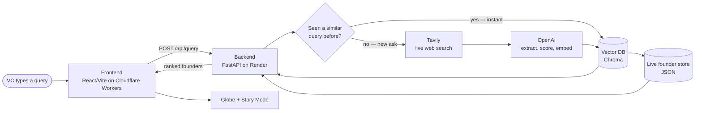
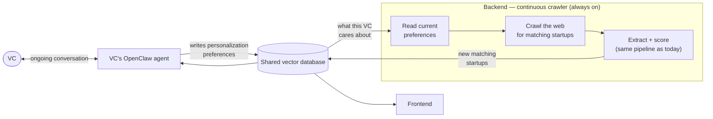

# Profound — the VC's own investment brain

## Live Demo

🚀 **Try Profound:** https://proffound.o-cthegreatest.workers.dev/

A VC describes who they're looking for in plain language. Profound doesn't hand back search snippets — it researches the web, builds an evidence-backed founder profile, and presents it as an explorable brain: a knowledge-graph reveal, a globe of ranked candidates, and a cinematic story per founder.

## The idea

Most great early founders never show up in the channels VCs already watch — a hackathon winner, a pre-seed builder who hasn't registered anywhere, a researcher whose work has commercial legs nobody's noticed yet. By the time they hit Crunchbase or a warm intro, someone else already found them.

Profound is built to close that gap, with one non-negotiable design constraint: **every claim is either sourced with a real URL or explicitly marked "inferred."** A VC can't act on a scorecard they can't verify, so the evidence discipline isn't a nice-to-have — it's enforced in the extraction prompt and in code (unsourced numbers get dropped, not shown).

**Where this is headed:** Profound isn't meant to stay a one-shot search box. The vision is for it to become the VC's own **OpenClaw agent** — the persistent assistant they already talk to regularly about deal flow — sharing its "brain" (the same vector database this repo's backend writes to) with this frontend, so what the agent learns in conversation shapes what the backend goes looking for next. **That agent layer is not built yet.** What's in this repo today is the search-and-extract pipeline and the frontend that renders it — see [Status](#status).

## Product flow

**Brain** (type a natural-language query) → **Globe** (spins while the search runs, ranked pins drop in when ready) → **Story** (six beats per founder — hook, background, scorecard, signals, fit, contact — with every source consolidated into a References list) → **Quote** (lead capture).

## Technical architecture

### Flow diagram — what's built today



Request-triggered, one shot: nothing happens until a VC types a query into the frontend. There's no standing process and no OpenClaw agent anywhere in this picture.

### Vision pipeline — roadmap, not built

The direction this is heading: the backend stops waiting for a query and instead **runs continuously**, crawling on its own initiative for startups that match what it already knows about the VC — and the VC's OpenClaw agent and the backend's crawler read and write **the same vector database**, so anything one side learns, the other can act on.



Two things change versus the diagram above: **(1)** the crawler is no longer triggered by a query — it runs on a loop, pulling personalization signals out of the VC's OpenClaw conversations and going out to find matches on its own; **(2)** OpenClaw and the frontend become two read/write views onto one shared database instead of the frontend being the only consumer.

### Stack

**Frontend** — React + TypeScript + Vite, Material UI, Framer Motion, `react-force-graph-2d` (the query knowledge-graph), `react-globe.gl` / Three.js (the results globe), Recharts (scorecard radar), Zustand (state). Deployed to **Cloudflare Workers** (static assets), auto-deployed on every git push via Cloudflare's GitHub connector.

**Backend** — FastAPI (Python), packaged as a Docker container, deployed on **Render**. Per-IP sliding-window rate limiting in front of `/api/query` to protect OpenAI/Tavily quota. CORS wired to the Cloudflare frontend origin.

**Data / AI layer**
- **Tavily** — live web search for founder signals (raw results only — no embeddings happen here, that's Chroma's job)
- **OpenAI `gpt-4o-mini`** — entity-type-aware extraction (classifies each find as startup / hackathon project / research / indie project), scoring, and enrichment
- **OpenAI `text-embedding-3-small`** — embeds both queries and founder profiles
- **Chroma** — local vector DB, two collections: `founders` (semantic search over profiles) and `queries` (cache of past search embeddings — **cosine similarity ≥ 0.90 against a prior query = cache hit**, skips Tavily/OpenAI entirely)
- **Live store** — JSON-backed store of the actual structured Founder/Fit objects (Chroma only holds vectors + light metadata)
- **Demo dataset** — 7 scripted founders the whole app gracefully falls back to whenever live keys are missing or a live call fails

## Implementation notes

**Cache-then-crawl request lifecycle:**
1. Embed the incoming query text
2. Check the `queries` cache for a semantically similar past search — hit → return the same founders instantly, zero external calls
3. Miss → live Tavily search
4. GPT classifies entity type and extracts a structured, evidence-linked profile: team with real contact info, 5-dimension scorecard, 3 VC metrics (scalability, market gap, innovation), signals, story beats, images — every claim cites a real source or is marked inferred
5. A second enrichment pass does targeted per-person searches to fill in team contacts/images
6. New founders are written into both the vector store (future recall) and the live store (source of truth)
7. Response reflects **only the current search's results** — the globe/leaderboard never shows stale founders from a previous query, even though the cache accumulates underneath

**Graceful degradation is load-bearing, not an afterthought:** every external dependency (`TAVILY_API_KEY`, `OPENAI_API_KEY`) is optional — its absence just switches that subsystem back to the scripted demo dataset instead of failing. This is what makes the demo safe to run without live keys and what makes a mid-demo API outage non-fatal.

## Running locally

**Prerequisites:** Node 18+, Python 3.10+, a Tavily API key and an OpenAI API key.

```bash
# Backend — from the repo root (VC_Brain/), not backend/, since it's
# imported as the `backend` package
python -m venv .venv && .venv/Scripts/activate   # .venv/bin/activate on macOS/Linux
pip install -r backend/requirements.txt
cp backend/.env.example backend/.env   # fill in TAVILY_API_KEY / OPENAI_API_KEY, or leave blank for demo mode
uvicorn backend.main:app --reload --port 8000

# Frontend — in a second terminal
cd frontend
npm install
npm run dev            # proxies /api to localhost:8000, see vite.config.ts
```

Open `http://localhost:5173`.

## Status

| Layer | State |
|---|---|
| Frontend (Brain / Globe / Story / Quote) | ✅ Built |
| Backend search-and-extract pipeline | ✅ Built |
| Cache-then-crawl vector store | ✅ Built |
| Cloudflare Workers + Render deployment | ✅ Deployed |
| OpenClaw agent layer | 🚧 Not built — roadmap |
| Continuous/always-on crawler | 🚧 Not built — roadmap |

See [`ARCHITECTURE.md`](ARCHITECTURE.md) for the standalone architecture reference.
